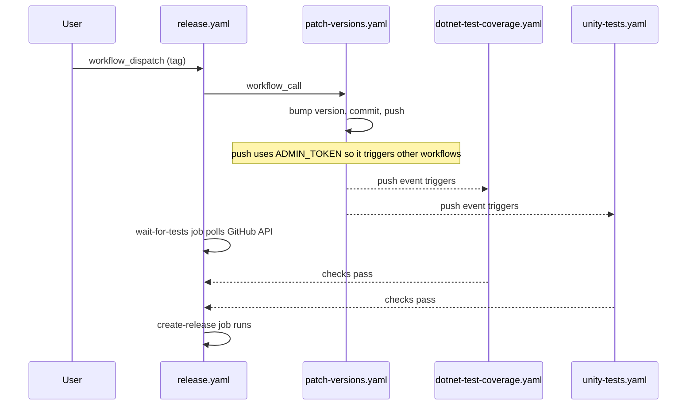

# Decision Record for CI Workflow Coordination

## Status

proposed

## Context

When `release.yaml` calls `patch-versions.yaml`, a new commit is pushed to `master` using `ADMIN_TOKEN` (PAT). This push will auto-trigger any workflows listening on `push: master`. The release must wait for those test runs to pass before creating the GitHub release.

## Decision

Split CI into two separate workflow files and coordinate them through the GitHub Checks API:

- **dotnet-test-coverage.yaml** — runs standalone .NET tests with coverage on PR to master and on every push to master. Posts a coverage summary comment on PRs.
- **unity-tests.yaml** — runs Unity editmode tests across all LTS versions on every push to master and on manual dispatch.
- **release.yaml** — after `patch-versions` pushes a version-bump commit, uses `lewagon/wait-on-check-action` to poll the Checks API on the new commit SHA until all auto-triggered test workflows pass, then creates the GitHub release.

### Release flow

## Consequences

- Every push to master is validated by both standalone and Unity tests automatically.
- Releases cannot be created unless all tests pass on the version-bump commit.
- Edge cases handled:
  - **No version change** (SHA is empty): `wait-for-tests` is skipped, `create-release` still runs.
  - **Tests fail**: `wait-for-tests` fails, `create-release` is skipped (release is not created).
  - **Direct push to master** (not via release): both test workflows trigger normally, no release created.
  - **Manual Unity test run**: `workflow_dispatch` trigger is preserved on `unity-tests.yaml`.
