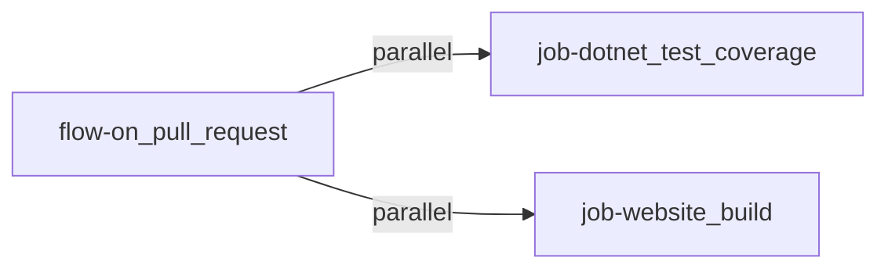
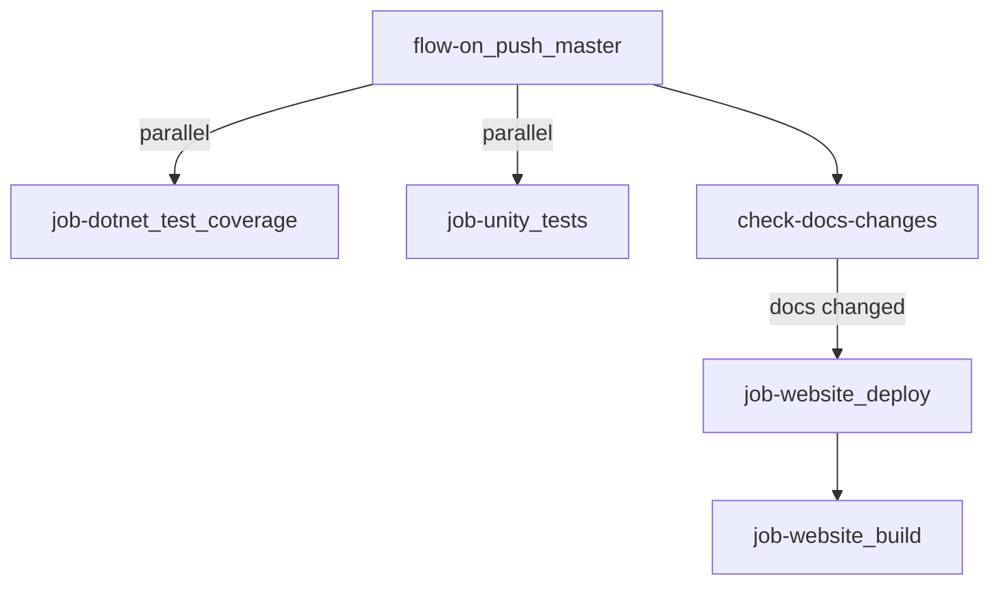
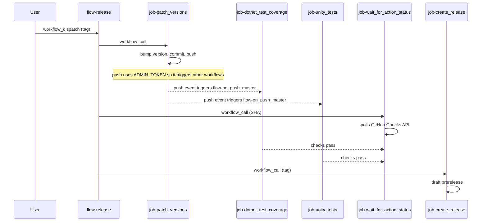

# Decision Record for CI Workflow Coordination

## Status

proposed

## Context

The project has multiple CI concerns (test coverage, Unity tests, website build/deploy, versioning, releases) that previously lived in separate workflow files, each with their own triggers. This produced many independent runs in the GitHub Actions tab, making it hard to follow the overall state of a push or PR at a glance.

When `flow-release.yaml` calls `job-patch_versions.yaml`, a new commit is pushed to `master` using `ADMIN_TOKEN` (PAT). This push will auto-trigger any workflows listening on `push: master`. The release must wait for those test runs to pass before creating the GitHub release.

## Decision

Adopt an **orchestrator / reusable-job** pattern with exactly three entry-point workflows (see [Naming Convention](ci-workflow-naming-convention.md) for file naming rules):

### Orchestrators (flow-)

| Workflow | Trigger | Jobs called (parallel unless noted) |
|---|---|---|
| `flow-on_pull_request` | `pull_request` to `master` | `job-dotnet_test_coverage`, `job-website_build` |
| `flow-on_push_master` | `push` to `master` | `job-dotnet_test_coverage`, `job-unity_tests`, `job-website_deploy` (conditional on docs changes) |
| `flow-release` | `workflow_dispatch` (tag) | `job-patch_versions` → `job-wait_for_action_status` → `job-create_release` (sequential) |

### Reusable jobs (job-)

Each `job-` file uses `on: workflow_call` and is called exclusively from `flow-` files.

| Job | Purpose |
|---|---|
| `job-dotnet_test_coverage` | .NET standalone tests with coverage; posts PR comment on pull requests |
| `job-website_build` | Builds the Docusaurus site; optionally uploads artifact |
| `job-website_deploy` | Builds and deploys the website to GitHub Pages (calls `job-website_build` internally) |
| `job-unity_tests` | Unity editmode tests across LTS matrix |
| `job-patch_versions` | Bumps version numbers, commits, tags, and pushes |
| `job-wait_for_action_status` | Polls GitHub Checks API until all checks on a SHA pass |
| `job-create_release` | Creates a draft prerelease on GitHub |

### Pull request flow

### Push to master flow

### Release flow

## Consequences

- The GitHub Actions tab shows exactly three workflow runs per event instead of many independent ones.
- Each run displays a single flow diagram containing all related jobs.
- Every push to master is validated by both standalone and Unity tests automatically.
- Releases cannot be created unless all tests pass on the version-bump commit.
- Edge cases handled:
  - **No version change** (SHA is empty): `job-wait_for_action_status` is skipped, `job-create_release` still runs.
  - **Tests fail**: `job-wait_for_action_status` fails, `job-create_release` is skipped.
  - **Direct push to master** (not via release): `flow-on_push_master` triggers normally, no release created.
  - **Docs not changed**: `job-website_deploy` is skipped in `flow-on_push_master`.
  - **Manual version bump**: `job-patch_versions` retains `workflow_dispatch` for standalone use.

## See also

- [Code Coverage Threshold in CI](code-coverage-threshold.md) — automated enforcement of the 95% coverage threshold via `job-dotnet_test_coverage`
- [CI Workflow Naming Convention](ci-workflow-naming-convention.md) — file naming rules (`flow-` / `job-` prefixes, separators)
- [.NET Scripts for CI Workflows](0.0.4/dotnet-scripts-for-ci.md) — why CI scripts are written in C# instead of Bash
