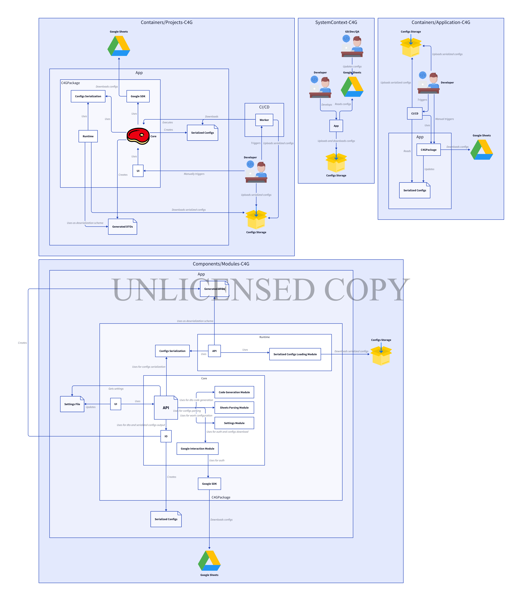

# Decision Record for Modular C4G Design

## Status

Proposed

## Context

Previous versions of the package were designed as a "proof-of-concept".
Now that we have proven the basic hypothesis works, to continue development, the code must gain better structure.
It is necessary to create controlled extension points and maintain a high level of test coverage.

## Decision

Restructure tool using C4 model as such
[Link to diagram](https://play.d2lang.com/?script=7Fdfb9s2EH_XpzgI2KOlNOuw1RgGBPIaGF2RrGmwZ0K6yFwkUiCpuN3g7z5QIiVKpOo6CTKg6ENi_bn73R_e7-5081kqrDPOFH5Sq-z15Rr-jQA2-IAVb1BEABdNEwFccl5WCDc7RCX1_Sbd4EP650UEkHF2R0sJN4oLUmLkAsDqN42whtg8knGPqV9MQNcQf0BSSMh7uNi1EpK-bQqicCJvcGcOdbIV19iEFVDwPevvBk3X4z4DAHJHGlwDrXVI-gHNOVvDTqlGrtNU38lEoRBEKtHmKsl5naKUyBQllfzh_O3Z2U-rRvBSkLpGkciHMgI4RPNsPsmg5DkllTb24y-rsoNdFYI-4MScTeNLxOYl_wkmKbsTRFt79WpVEEVWsgcd7B2iSBcvoQyFTC-apqI5UZSzxVq2_mSvL69Jfm-9uUFBSUX_wcIGEM3EdGH5UmMdxtECkLU45KCxRg9R_zcn15xQANk2zTZRH0Ey9WlOi82Xy9sQ0gFZQ_yesJZUoAQtSxQdlSYKy4SSY7iL5jrn1xB_dOC7Z0FfbiX6EsHEd-1iIvp4P79B1v-PRLwW_G_MlTyBhSNLbrfmIuMCzeWHlila2zubyM27QdKEak65awHRgNeXhnCry-K7DNq8WxAIws9kjYfHxR3sMebAsfhHs9_vdb4FNryvgh3fp-dvfj4_e5PWSJQ5DNtZ7P9Aa-uSiAwFUVjA5uOV1-0SG3uQeZnAvuUtKE2xXYW5hpM2T0nnC4iEAqWbSZD5DmvyqH4biPzZ2rMF-ouL-67OD0cab3K7HXpv9XnSfWeCY4V-Zcd__v6d9GGF2rh5FQjQkO73T5i3Chc1gjU2RBXSOjmgmWMhtg5QYz6_T40XmBp1wxkyJdP3vGgrdIbGKYPC7aUX19vhOuMFWsbr5tEbGV73aYVrIiRl5fytyf2WKRQkD-lvr0YoVIqyUloR1x2Htj6YbXV3XABp1a77SjH1NnytxHO4oOculEVoegkPIJwZF6FQHHItVQ5SHsr2aq6hvfeJA7xVTav8MKZZc8H2XNwb9dZad9XdI_e79zgAx19D-6Va8fsQ_MFJ4RSG7_0RjdmWcPjiwuJtN1O3k-Hgjq8jmhLJYsUFt56h_mJvcUq6bPsGvsKhSSlO5nh88o4yYdlbas9jNnCS7dWjFhejd_LuYrNw8v4yg7ud8kHH535desHDrysvhP6cLnVjkEb2JfYk37mnb1XPsgWFx35ylLaPXAy-7Vn9XwAAAP__&layout=tala&)

### Level 1 - System Context

The system represents a configuration management solution through Google Sheets with centralized storage.
Developers and GD/Dev/QA teams work with configurations through the convenient Google Sheets interface, while the application automatically synchronizes and distributes these configurations.

### Level 2 - Container

The architecture is built around C4GPackage as the central component that transforms configurations from Google Sheets into serialized files.
CI/CD integration ensures deployment process automation, while the separation of package and serialized configurations allows independent management of logic and data.

### Level 3 - Component

C4GPackage is divided into Core (processing and generation) and Runtime (execution) modules.
Core handles Google Sheets parsing, DTO generation, and configuration serialization, while Runtime provides loading and usage of ready configurations in application runtime.

### Level 4 - Code

The modular architecture of Core includes specialized components: API as a facade, separate modules for Google interaction, sheet parsing, code generation, and settings management.
This ensures high cohesion within modules and loose coupling between them.

## Consequences

This modular architecture will enable easier testing of individual components in isolation, reducing the complexity of unit tests and improving test coverage.
Extension points become well-defined through module interfaces, facilitating future feature additions without breaking existing functionality.
However, this restructuring will require significant refactoring effort and may temporarily slow development velocity.
The increased number of modules and interfaces may also introduce additional complexity in dependency management and configuration.
