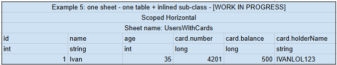

# Inlined Subclasses

C4G supports nested data structures directly within a single sheet row using dot notation in column headers.

## Overview

Some game configs contain properties that belong to a typed sub-object — for example, a reward with both an `amount` and a `type`. Without inlined subclasses, such structures would require separate sheets or manual post-processing.

Inlined subclasses let you express sub-objects inline within a single sheet row using a simple naming convention.

## Column Header Convention

Use dot notation to declare a subclass property: `SubTypeName.PropertyName`.



During sheet parsing, any column header containing a dot is split into a subtype name and a property name. Subtypes are collected per config and referenced by index, so the generated code reconstructs the nested object without extra sheets or runtime lookups.

## Example

If you have a `Reward` sub-object with `Amount` and `Type` properties, name your columns:

```
Reward.Amount    Reward.Type
100              Gold
50               Gem
```

C4G will generate a `Reward` class and wire it up automatically.

## Constraints

- A dot in a column header is **always** interpreted as a subtype separator.
- Column names that use dots for any other purpose will be misinterpreted and must be renamed.
